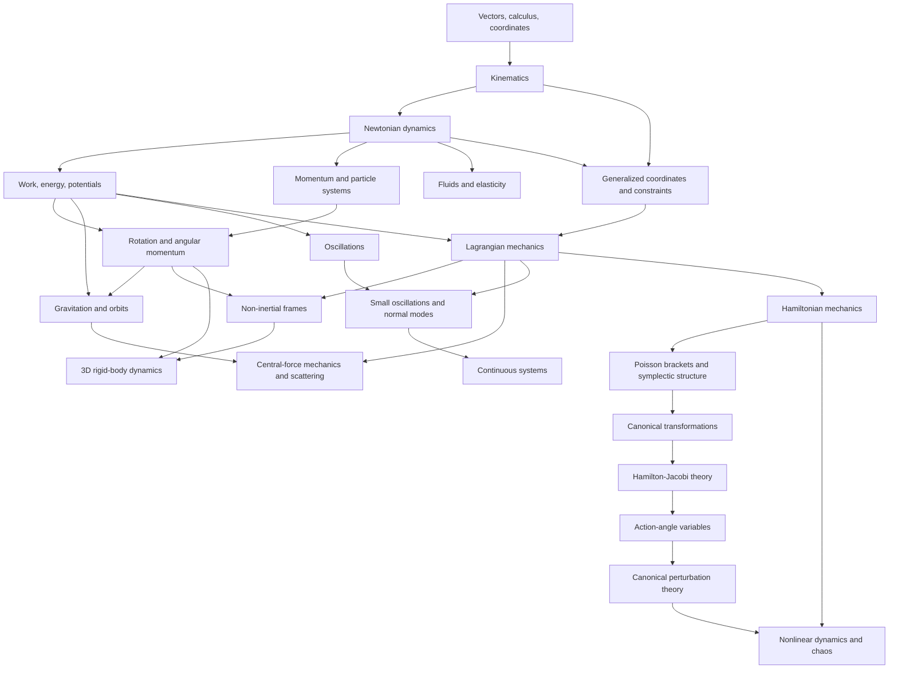

# Mechanics Learning Path

Classical mechanics is best learned as one connected chain of ideas rather than as a collection of unrelated formulas. A student first learns how to **describe motion**, then how **forces change motion**, then how **energy and momentum provide alternate ways to solve the same dynamics**, and then how these ideas extend to rotating bodies, gravitating systems, oscillators, fluids, constrained systems, and finally the Lagrangian and Hamiltonian formulations used in advanced mechanics.

This page is the student-facing roadmap for the PhysicsLibrary mechanics collection. It is intended to take a learner from the beginning of a calculus-based college physics course through upper-undergraduate analytical mechanics and into the main topics of a graduate classical-mechanics course at approximately the level of Goldstein.

The central progression is

\[
\boxed{
\text{motion}
\rightarrow
\text{forces}
\rightarrow
\text{energy and momentum}
\rightarrow
\text{rotation and systems}
\rightarrow
\text{oscillations, gravity, and fluids}
\rightarrow
\text{generalized coordinates}
\rightarrow
\text{Lagrangian mechanics}
\rightarrow
\text{Hamiltonian mechanics}
\rightarrow
\text{advanced dynamics}
}
\]

The PhysicsLibrary PACS classification remains useful for cataloging articles, but this learning path deliberately orders material by **prerequisite and conceptual dependence**, not by PACS number.

---

## 1. Who should use this path?

There are four natural entry points.

### First-year college physics

Start at **Stage A: Mathematical and kinematic foundations** and follow the path sequentially through fluids and oscillations. This route is intended for a calculus-based introductory physics course.

### GRE Physics preparation

A student who has already completed introductory mechanics should use the diagnostic below and then concentrate on the topics marked **GRE Core**. The GRE route includes some material that is often deferred beyond first-year physics, especially three-dimensional dynamics, non-inertial frames, and introductory Lagrangian and Hamiltonian mechanics.

### Upper-undergraduate analytical mechanics

A student entering a junior/senior mechanics course should be comfortable with Newtonian mechanics, energy, momentum, rotation, gravitation, and ordinary differential equations. Begin with generalized coordinates and constraints, then proceed through Lagrangian mechanics, central forces, small oscillations, non-inertial frames, and rigid-body dynamics.

### Graduate classical mechanics

A graduate student should treat the earlier stages as review and begin where needed. The graduate route emphasizes Hamiltonian mechanics, Poisson brackets, canonical transformations, Hamilton-Jacobi theory, action-angle variables, perturbation theory, rigid-body dynamics, nonlinear dynamics, and continuum/field extensions.

---

## 2. Readiness diagnostic

This diagnostic is not an exam. Its purpose is to identify the earliest point in the path that should be reviewed.

A student ready for the **freshman mechanics core** should be able to answer yes to most of the following:

1. Can you resolve a vector into Cartesian components?
2. Can you distinguish a scalar from a vector?
3. Can you interpret a derivative as a rate of change?
4. Can you interpret an integral as accumulated change or area under a curve?
5. Can you solve a simple algebraic equation for an unknown quantity?
6. Can you use basic trigonometric relations in a right triangle?

If several answers are no, begin with M00 foundations before continuing.

A student ready for **upper-undergraduate analytical mechanics** should also be able to answer yes to most of these:

7. Can you draw a correct free-body diagram for a block on an incline?
8. Can you decide when energy conservation is easier than Newton's second law?
9. Can you use conservation of momentum in a collision?
10. Can you compute or use a moment of inertia?
11. Can you use angular momentum and torque as vectors?
12. Can you solve a second-order ordinary differential equation such as a harmonic oscillator?
13. Can you work with partial derivatives and multivariable functions?
14. Can you perform basic matrix operations and find eigenvalues/eigenvectors in simple cases?

A student ready for the **graduate mechanics path** should additionally be comfortable with:

15. generalized coordinates and Lagrange's equations;
16. multivariable Taylor expansion;
17. linear algebra for coupled differential equations;
18. vector calculus and coordinate transformations;
19. first-order systems of ordinary differential equations;
20. the meaning of a variational principle.

If one of these graduate prerequisites is weak, use the relevant upper-undergraduate section as a targeted review rather than restarting the entire sequence.

---

# 3. The complete mechanics path

## Stage A — Mathematical and kinematic foundations

**Goal:** learn the language used to describe motion before asking what causes it.

### A1. Units and dimensional analysis — M00-03

Learn dimensions, SI units, scaling, order-of-magnitude reasoning, and dimensional consistency. Dimensional analysis becomes a powerful error-checking and GRE-speed tool throughout mechanics.

### A2. Scalars and vectors — M00-04

Learn vector components, unit vectors, dot products, and cross products. Mechanics is inherently vectorial: velocity, acceleration, force, momentum, torque, and angular momentum all depend on direction.

### A3. Coordinate systems — M00-05

Begin with Cartesian coordinates and then learn why cylindrical and spherical coordinates become useful when the geometry of a problem has rotational or radial symmetry.

### A4. Position, velocity, and acceleration — M01-01 through M01-03

The fundamental kinematic hierarchy is

\[
\mathbf v = \frac{d\mathbf r}{dt},
\qquad
\mathbf a = \frac{d\mathbf v}{dt}
           = \frac{d^2\mathbf r}{dt^2}.
\]

A student should be able to move in both directions through this hierarchy: differentiate position to obtain velocity and acceleration, or integrate acceleration subject to initial conditions to recover velocity and position.

### A5. Motion graphs and constant acceleration — M01-04 through M01-05

Connect algebra and calculus to the geometry of position-time, velocity-time, and acceleration-time graphs. Learn the constant-acceleration equations as consequences of integration, not as isolated formulas to memorize.

### A6. Two- and three-dimensional kinematics — M01-07 through M01-11

Study projectile motion, uniform circular motion, relative motion, and eventually polar/cylindrical/spherical coordinate kinematics.

**Checkpoint A:** Given \(\mathbf r(t)\), you should be able to obtain velocity and acceleration, interpret their directions, and describe the resulting motion.

---

## Stage B — Newtonian dynamics

**Goal:** connect motion to physical interactions.

### B1. Newton's laws — M02-01

Newton's second law is the central local equation of Newtonian particle mechanics:

\[
\sum \mathbf F = \frac{d\mathbf p}{dt},
\]

which reduces to

\[
\sum \mathbf F = m\mathbf a
\]

for constant mass.

### B2. Free-body diagrams — M02-02

A free-body diagram is the bridge between a physical situation and the equations of motion. Learn to isolate the body or system, identify only the forces acting on it, choose coordinates, and translate the diagram into component equations.

### B3. Common forces — M02-03 through M02-10

Build fluency with:

- weight;
- normal forces;
- tension;
- static and kinetic friction;
- ideal springs;
- linear and quadratic drag;
- pulley constraints and connected-particle systems.

### B4. Curved-path dynamics — M02-11

Uniform circular motion introduces an important distinction: an object may have constant **speed** while its **velocity** changes continuously. Radial acceleration provides the first strong example of geometry determining the useful force decomposition.

**Checkpoint B:** Given a physical configuration, you should be able to draw a free-body diagram and produce the corresponding differential equation or algebraic equation of motion.

---

## Stage C — Work, energy, and potentials

**Goal:** learn a second description of dynamics that often avoids solving explicitly for acceleration as a function of time.

### C1. Work and kinetic energy — M03-01 through M03-03

For a particle,

\[
W_{1\rightarrow2}
= \int_1^2 \mathbf F\cdot d\mathbf r,
\]

and the net work changes kinetic energy:

\[
W_{\mathrm{net}}=\Delta T.
\]

### C2. Conservative forces and potential energy — M03-05 through M03-07

For a conservative force,

\[
\mathbf F=-\nabla U,
\]

so information that was previously carried by the force can be represented by a scalar potential-energy function.

### C3. Mechanical-energy conservation — M03-08

When only conservative interactions transfer energy within the modeled system,

\[
E=T+U=\text{constant}.
\]

### C4. Potential-energy diagrams — M03-09

Potential diagrams introduce turning points, accessible regions, equilibrium, and stability. This becomes one of the most important conceptual tools in advanced mechanics because the same idea reappears in central-force effective potentials and nonlinear dynamics.

**Checkpoint C:** You should be able to decide whether a problem is more naturally solved with force equations or with energy, and explain why.

---

## Stage D — Momentum and systems of particles

**Goal:** move from a single particle to interacting systems and discover conservation laws tied to internal forces.

### D1. Linear momentum and impulse — M04-01 through M04-03

Learn

\[
\mathbf p=m\mathbf v,
\qquad
\mathbf J=\int \mathbf F\,dt=\Delta \mathbf p.
\]

For an isolated system,

\[
\mathbf P=\sum_i \mathbf p_i
\]

is conserved.

### D2. Center of mass — M04-04 through M04-05

The center of mass separates bulk translation from internal motion. The total external force controls center-of-mass motion:

\[
M\mathbf a_{CM}=\sum \mathbf F_{\mathrm{ext}}.
\]

### D3. Collisions — M04-06 through M04-07

Study elastic, inelastic, and perfectly inelastic collisions in one and two dimensions. Learn carefully which quantities are conserved under which assumptions.

### D4. Variable-mass systems — M04-09

The rocket equation is a useful culmination of particle-system momentum bookkeeping and prepares the student for more sophisticated control-volume reasoning.

**Checkpoint D:** You should be able to choose the appropriate system boundary and state whether linear momentum, kinetic energy, both, or neither are conserved during an interaction.

---

## Stage E — Rotation, angular momentum, and statics

**Goal:** extend translational mechanics to rigid bodies and rotational degrees of freedom.

The analogy between translation and fixed-axis rotation is useful but should not be treated as exact in all three-dimensional situations:

| Translation | Fixed-axis rotation |
|---|---|
| position \(x\) | angle \(\theta\) |
| velocity \(v\) | angular velocity \(\omega\) |
| acceleration \(a\) | angular acceleration \(\alpha\) |
| mass \(m\) | moment of inertia \(I\) |
| force \(F\) | torque \(\tau\) |
| momentum \(p\) | angular momentum \(L\) |
| \(T=\tfrac12 mv^2\) | \(T=\tfrac12 I\omega^2\) |

### E1. Rotational kinematics — M05-01

### E2. Torque and moment of inertia — M05-02 through M05-04

### E3. Rotational dynamics, work, and energy — M05-05 through M05-07

### E4. Angular momentum — M05-08 through M05-10

### E5. Rolling without slipping — M05-11

Rolling combines translation and rotation through the kinematic constraint

\[
v_{CM}=R\omega
\]

for pure rolling on a stationary surface.

### E6. Static equilibrium — M05-12

For rigid-body equilibrium,

\[
\sum \mathbf F=0,
\qquad
\sum \boldsymbol\tau=0.
\]

**Checkpoint E:** You should be able to solve fixed-axis rotational dynamics, rolling-energy problems, angular-momentum conservation problems, and elementary rigid-body statics.

---

## Stage F — Gravitation and orbital mechanics

**Goal:** apply particle mechanics and conservation laws to an inverse-square central force.

### F1. Newtonian gravitation — M06-01 through M06-03

### F2. Escape, circular orbits, and orbital energy — M06-04 through M06-05

### F3. Kepler's laws — M06-06 through M06-07

This stage should be learned twice: first at the introductory level using Newtonian dynamics and conservation laws, and later at the analytical-mechanics level using reduced mass and the central-force effective potential.

### F4. Two-body reduction — M06-08

The two-body problem can be transformed into center-of-mass motion plus a one-body relative-motion problem with reduced mass

\[
\mu=\frac{m_1m_2}{m_1+m_2}.
\]

### F5. Effective potential — M06-09

The effective-potential viewpoint becomes the entrance to advanced central-force mechanics.

**Checkpoint F:** At the introductory level, you should be able to derive circular-orbit speed, period, energy, and escape speed. At the advanced level, you should be able to reduce a two-body problem to one effective particle.

---

## Stage G — Oscillations

**Goal:** understand why approximately harmonic motion appears throughout physics and engineering.

### G1. Simple harmonic motion — M07-01 through M07-03

The model equation

\[
\ddot x+\omega_0^2x=0
\]

is one of the central differential equations of physics. Learn its solution, energy exchange, phase, and the small-angle pendulum approximation.

### G2. Damping and forcing — M07-05 through M07-08

Extend the oscillator to

\[
\ddot x+2\beta\dot x+\omega_0^2x
=\frac{F_0}{m}\cos\omega t.
\]

This introduces transients, steady-state response, resonance, phase lag, bandwidth, and quality factor.

### G3. Coupled oscillators and normal modes — M07-09 through M07-10

Coupled oscillators provide the first mechanics application in which eigenvalues and eigenvectors become physically unavoidable.

### G4. Anharmonic and nonlinear oscillation — M07-11 through M07-12

Relax the harmonic approximation and study amplitude-dependent behavior and phase-space structure.

**Checkpoint G:** You should understand the harmonic oscillator in both time-domain and energy/phase descriptions and be able to identify resonance and normal-mode behavior.

---

## Stage H — Fluids and elasticity

**Goal:** extend mechanics from discrete particles and rigid bodies toward continuous media.

### H1. Pressure and hydrostatics — M08-01 through M08-04

Study density, pressure, hydrostatic variation, Pascal's principle, buoyancy, and Archimedes' principle.

### H2. Fluid flow — M08-05 through M08-09

Learn conservation of mass through continuity and conservation of mechanical energy through Bernoulli's equation, then introduce viscosity, Poiseuille flow, and Reynolds number.

### H3. Stress, strain, and elasticity — M08-11 through M08-12

Elasticity provides the bridge from rigid bodies to deformable solids and eventually continuum mechanics.

**Checkpoint H:** You should be able to solve basic hydrostatic, buoyancy, continuity, and Bernoulli problems and explain the assumptions behind each model.

---

# 4. GRE Physics mechanics route

The GRE Physics Subject Test currently assigns about **20%** of its content to classical mechanics and expects most problems to be answerable from the first three years of undergraduate physics. The mechanics preparation path therefore extends slightly beyond the normal first-year sequence.

A GRE-focused student should master Stages A-H and then add the following topics before relying mainly on mixed practice:

1. **Three-dimensional particle dynamics** — M10-01.
2. **Non-inertial reference frames** — M10-02 through M10-06.
3. **Generalized coordinates** — M09-01.
4. **Hamilton's principle and Lagrange's equations** — M09-06 through M09-07.
5. **Generalized momentum** — M09-10.
6. **Legendre transform, Hamiltonian, and Hamilton's equations** — M14-01 through M14-03.
7. **Central-force effective-potential reasoning** — M11-01 through M11-04 at least conceptually.

## GRE coverage map

| GRE classical-mechanics area | PhysicsLibrary path |
|---|---|
| Kinematics | Stages A and M10-01 |
| Newton's laws | Stage B |
| Work and energy | Stage C |
| Oscillatory motion | Stage G |
| Rotational motion about a fixed axis | Stage E |
| Dynamics of systems of particles | Stage D |
| Central forces and celestial mechanics | Stage F + M11 |
| Three-dimensional particle dynamics | M01-10, M01-11, M10-01 |
| Lagrangian and Hamiltonian formalism | M09 + M14-01 through M14-03 |
| Non-inertial reference frames | M10 |
| Elementary fluid dynamics | Stage H |

## GRE problem-solving habits

GRE mechanics questions reward fast recognition of structure. In addition to full derivations, practice:

- dimensional elimination of impossible answers;
- ratio and scaling arguments;
- conservation-law recognition before algebra;
- limiting cases;
- symmetry arguments;
- sign and direction checks;
- graph interpretation;
- estimation and order-of-magnitude reasoning;
- recognizing canonical equations such as SHO, circular motion, Bernoulli, Lagrange, and Hamilton equations.

GRE-specific exercises in PhysicsLibrary should therefore supplement rather than replace longer textbook-style problems.

---

# 5. Upper-undergraduate analytical mechanics

Once Newtonian mechanics is comfortable, the subject changes character. Instead of asking only which forces act on each Cartesian coordinate, analytical mechanics asks which coordinates best describe the system, which constraints reduce its motion, and which scalar functions encode the dynamics.

## Stage I — Generalized coordinates and constraints

Follow M09-01 through M09-04:

\[
\text{degrees of freedom}
\rightarrow
\text{generalized coordinates}
\rightarrow
\text{constraints}
\rightarrow
\text{virtual displacement}
\rightarrow
\text{d'Alembert principle}.
\]

The major conceptual move is from coordinates imposed by the laboratory to coordinates adapted to the system.

For example, a particle constrained to a circle in a plane could be described with two Cartesian coordinates plus a constraint,

\[
x^2+y^2=R^2,
\]

or with the single generalized coordinate \(\theta\):

\[
x=R\cos\theta,
\qquad
y=R\sin\theta.
\]

The second description exposes the system's true single degree of freedom.

## Stage J — Variational and Lagrangian mechanics

Follow M09-05 through M09-12.

The action is

\[
S[q]=\int_{t_1}^{t_2}L(q,\dot q,t)\,dt,
\]

and Hamilton's principle leads to the Euler-Lagrange equations

\[
\frac{d}{dt}\left(\frac{\partial L}{\partial \dot q_i}\right)
-\frac{\partial L}{\partial q_i}=0.
\]

At this stage, emphasize:

- generalized forces;
- Lagrange multipliers;
- generalized momentum;
- cyclic coordinates;
- first integrals;
- symmetry and Noether's theorem.

**Checkpoint J:** Given a mechanical system with constraints, you should be able to choose generalized coordinates, construct \(T\) and \(U\), form \(L=T-U\), and derive equations of motion.

---

# 6. Intermediate analytical-mechanics applications

## Stage K — Non-inertial dynamics

Follow M10-02 through M10-08. The transport theorem links derivatives measured in inertial and rotating frames and produces the centrifugal, Coriolis, and Euler terms.

This section is important both for the GRE and for later rigid-body dynamics.

## Stage L — Central forces and scattering

Follow M11-01 through M11-09:

\[
\text{central-force conservation laws}
\rightarrow
U_{\mathrm{eff}}(r)
\rightarrow
\text{orbit equation}
\rightarrow
\text{Kepler problem}
\rightarrow
\text{scattering}.
\]

The central-force problem is one of the best places to see energy, angular momentum, symmetry, effective potentials, and differential equations operating together.

## Stage M — Small oscillations and normal modes

Follow M12-01 through M12-07.

Near stable equilibrium, many nonlinear systems reduce approximately to a quadratic Lagrangian. For generalized displacements \(\boldsymbol\eta\), the linearized equations take the form

\[
\mathbf M\ddot{\boldsymbol\eta}
+\mathbf K\boldsymbol\eta=0,
\]

leading to the generalized eigenvalue problem

\[
\det(\mathbf K-\omega^2\mathbf M)=0.
\]

This is the bridge from a single oscillator to molecular vibrations, structures, waves, and field modes.

## Stage N — Three-dimensional rigid-body mechanics

Follow M13.

The progression is

\[
\text{rotation representation}
\rightarrow
\boldsymbol\omega
\rightarrow
\mathbf I
\rightarrow
\mathbf L=\mathbf I\boldsymbol\omega
\rightarrow
\text{Euler equations}
\rightarrow
\text{precession and nutation}.
\]

PhysicsLibrary already contains substantial material on direction cosine matrices, Euler-angle sequences, axis-angle representations, and quaternions. These representations belong here, **after** the elementary mechanics of torque, inertia, and angular momentum has been mastered.

**Checkpoint N:** You should understand why angular momentum need not be parallel to angular velocity and be able to formulate rigid-body dynamics in principal-axis coordinates.

---

# 7. Hamiltonian mechanics

## Stage O — From the Lagrangian to phase space

Follow M14-01 through M14-05.

Define canonical momenta

\[
p_i=\frac{\partial L}{\partial \dot q_i},
\]

and perform a Legendre transform to obtain

\[
H(q,p,t)=\sum_i p_i\dot q_i-L.
\]

Hamilton's equations are

\[
\dot q_i=\frac{\partial H}{\partial p_i},
\qquad
\dot p_i=-\frac{\partial H}{\partial q_i}.
\]

The conceptual shift is important:

\[
\boxed{
\text{configuration-space, second-order dynamics}
\longrightarrow
\text{phase-space, first-order dynamics}
}
\]

The state of an \(n\)-degree-of-freedom Hamiltonian system is represented by \(2n\) canonical variables \((q_i,p_i)\).

## Stage P — Poisson and symplectic mechanics

Follow M14-06 through M14-10.

For functions \(f(q,p,t)\) and \(g(q,p,t)\), the Poisson bracket is

\[
\{f,g\}
=\sum_i
\left(
\frac{\partial f}{\partial q_i}
\frac{\partial g}{\partial p_i}
-
\frac{\partial f}{\partial p_i}
\frac{\partial g}{\partial q_i}
\right).
\]

It packages Hamiltonian time evolution, canonical structure, generators, and conservation laws into a common language. Liouville's theorem and symplectic geometry then reveal structural properties of Hamiltonian flow that are not obvious in Newton's vector equation.

**Checkpoint P:** You should be able to formulate a system in canonical variables, use Hamilton's equations, compute basic Poisson brackets, and explain phase-space volume preservation.

---

# 8. Graduate / Goldstein-level completion

## Stage Q — Canonical transformations

Follow M15-01 through M15-03. Learn canonical transformations, generating functions, and infinitesimal canonical transformations. The goal is not simply to change coordinates, but to change canonical variables while preserving Hamilton's form of the equations.

## Stage R — Hamilton-Jacobi theory

Follow M15-04 through M15-06. Hamilton-Jacobi theory seeks a canonical transformation that simplifies the dynamics maximally. Its central equation is

\[
H\left(q_i,\frac{\partial S}{\partial q_i},t\right)
+\frac{\partial S}{\partial t}=0.
\]

This framework connects classical mechanics to geometrical optics and provides an important conceptual bridge toward quantum mechanics.

## Stage S — Action-angle variables and perturbation theory

Follow M15-07 through M15-11. For integrable periodic systems, action-angle variables turn the motion into particularly simple canonical evolution. They then provide a natural starting point for slowly varying systems and near-integrable perturbations.

## Stage T — Nonlinear dynamics and chaos

Follow M16-01 through M16-04. Study fixed points, stability, bifurcations, Poincare sections, sensitivity to initial conditions, and the breakdown of simple integrability.

## Stage U — Continuous systems and fields

Follow M16-05 through M16-07. Extend the discrete action

\[
S=\int L\,dt
\]

to a field action

\[
S=\int \mathcal L(\phi,\partial_\mu\phi,x)\,d^4x,
\]

and connect particle mechanics to strings, elastic media, fluids, and classical field theory.

## Stage V — Relativistic mechanics bridge

Follow M16-08 through M16-09 after studying special relativity. Relativistic mechanics is a separate GRE content category, but its Lagrangian and Hamiltonian formulations naturally complete the classical-mechanics sequence.

---

# 9. Dependency map

The following graph shows the main conceptual dependencies. It intentionally omits many secondary cross-links.

---

# 10. Recommended study method

For each major article, use the same five-pass cycle.

### Pass 1 — Physical picture

Before manipulating equations, identify the system, its degrees of freedom, important interactions, relevant reference frame, and likely conservation laws.

### Pass 2 — Derivation

Work through the derivation of the governing result. Do not treat equations such as \(F=ma\), the work-energy theorem, Bernoulli's equation, the Euler-Lagrange equations, or Hamilton's equations as disconnected formulas.

### Pass 3 — Worked examples

Reproduce each worked example without looking at intermediate steps. Then change one assumption and predict how the result should change.

### Pass 4 — Exercises

Use a mixture of conceptual, algebraic, derivational, and computational exercises. Computational work becomes increasingly important in nonlinear dynamics, orbit mechanics, coupled oscillations, and rigid-body mechanics.

### Pass 5 — GRE-speed check

For GRE-relevant material, solve short timed problems that reward recognition and efficient reasoning rather than long derivations.

A student should not move forward merely because the text has been read. Progress is demonstrated by being able to **set up unfamiliar problems**.

---

# 11. Milestone checks

## Milestone 1 — Introductory particle mechanics

You can:

- translate motion between words, graphs, and equations;
- draw correct free-body diagrams;
- solve Newton's-law problems in one and two dimensions;
- use energy and momentum appropriately;
- analyze collisions and center-of-mass motion.

## Milestone 2 — Introductory rotational and continuum mechanics

You can:

- solve fixed-axis rotational dynamics;
- use torque and angular momentum;
- analyze rolling;
- solve elementary gravitation/orbit problems;
- solve SHO/damping/resonance problems;
- solve elementary hydrostatics and Bernoulli problems.

Completing Milestones 1 and 2 plus the designated GRE extensions gives the core of GRE mechanics preparation.

## Milestone 3 — Analytical mechanics

You can:

- identify degrees of freedom and constraints;
- select useful generalized coordinates;
- derive Lagrange's equations from an action principle;
- use generalized momenta and cyclic coordinates;
- analyze non-inertial frames, central forces, and small oscillations.

## Milestone 4 — Advanced rigid-body and Hamiltonian mechanics

You can:

- use the inertia tensor and principal axes;
- derive/use Euler's rigid-body equations;
- formulate Hamilton's equations;
- work in phase space;
- compute and interpret Poisson brackets.

## Milestone 5 — Graduate mechanics

You can:

- use canonical transformations and generating functions;
- solve representative Hamilton-Jacobi problems;
- use action-angle variables;
- understand perturbative and nonlinear departures from integrability;
- connect discrete mechanics to continuum and field formulations.

---

# 12. Current PhysicsLibrary starting points

The learning path is being filled incrementally. Existing material can already be found in these PhysicsLibrary areas:

- Classical mechanics of discrete systems: https://physicslibrary.org/browse/objects/45./
- General classical mechanics: https://physicslibrary.org/browse/objects/45.05.%2Bx/
- Newtonian mechanics: https://physicslibrary.org/browse/objects/45.20.Dd/
- Lagrangian and Hamiltonian mechanics: https://physicslibrary.org/browse/objects/45.20.Jj/
- Rigid-body dynamics and kinematics: https://physicslibrary.org/browse/objects/45.40.-f/
- Rigid-body and gyroscope motion: https://physicslibrary.org/browse/objects/45.40.Cc/
- Particle and particle-system mechanics: https://physicslibrary.org/browse/objects/45.50.-j/
- Celestial mechanics: https://physicslibrary.org/browse/objects/45.50.Pk/
- Fluid dynamics foundations: https://physicslibrary.org/browse/objects/47.10.%2Bg/
- Archimedes' principle / applied fluid mechanics: https://physicslibrary.org/browse/objects/47.85.Dh/
- Continuum mechanics of solids: https://physicslibrary.org/browse/objects/46-XX/

The implementation backlog for missing and upgraded articles is maintained separately in `Reports/Mechanics_Curriculum_Audit_and_Backlog.md`.

---

# 13. Source and licensing note

This PhysicsLibrary learning path is an original synthesis and expansion prepared for the PhysicsLibrary mechanics curriculum. Its sequencing was informed by several openly licensed curricula:

1. **Tom Weideman, UCD Physics 9A – Classical Mechanics**, Physics LibreTexts. The freshman progression through motion, force, work/energy, momentum, rotations, angular momentum, gravitation, and small oscillations is especially useful as a curriculum benchmark. License: **CC BY-SA 4.0**.  
   https://phys.libretexts.org/Courses/University_of_California_Davis/UCD%3A_Classical_Mechanics

2. **Wikibooks, Classical Mechanics**. Its advanced sequence provides a useful benchmark for generalized/Lagrangian mechanics, constrained systems, central forces, small oscillations, symmetries, rigid bodies, non-inertial frames, and Hamiltonian mechanics. Wikibooks text is generally available under **CC BY-SA 4.0** (and often also GFDL), subject to page-specific notices.  
   https://en.wikibooks.org/wiki/Classical_Mechanics  
   https://en.wikibooks.org/wiki/Wikibooks:Copyrights

3. **University Physics Volume 1, 2016 archived edition**, OpenStax/CNX via BCcampus Pressbooks. Used as a curriculum cross-check for introductory mechanics, fluids, and oscillations. The archived 2016 edition states **CC BY 4.0 except where otherwise noted**.  
   https://pressbooks.bccampus.ca/universityphysicssandboxbook1/

4. **Educational Testing Service, GRE Physics Subject Test content description**. Used only to identify current GRE scope and weighting; no ETS questions or proprietary explanatory text are reproduced here.  
   https://www.ets.org/gre/test-takers/subject-tests/about/content-structure.html

No external figures or media have been copied into this article. Any future imported figure must be checked and attributed at the individual-file level because media licenses may differ from the surrounding text.

## License

Unless otherwise noted, this PhysicsLibrary article is intended for release under the **Creative Commons Attribution-ShareAlike 4.0 International (CC BY-SA 4.0)** license.
